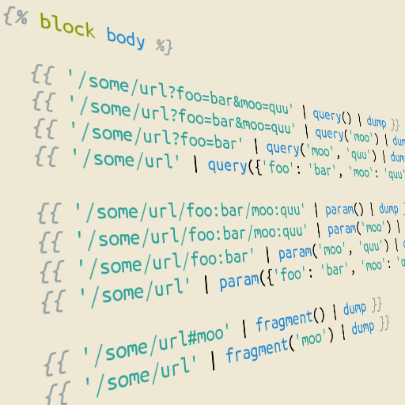

# Grav URL-Parameter Plugin

`urlparamfilter` is a simple [Grav](http://github.com/getgrav/grav) plugin that adds filters for accessing and manipulating URL-Parameters, Query-Strings and URL-Fragments in Templates.

# Installation

Installing the URL-Parameter plugin can be done in one of two ways. Our GPM (Grav Package Manager) installation method enables you to quickly and easily install the plugin with a simple terminal command, while the manual method enables you to do so via a zip file.

## GPM Installation (Preferred)

The simplest way to install this plugin is via the [Grav Package Manager (GPM)](http://learn.getgrav.org/advanced/grav-gpm) through your system's Terminal (also called the command line).  From the root of your Grav install type:

    bin/gpm install URL-Parameter

This will install the URL-Parameter plugin into your `/user/plugins` directory within Grav. Its files can be found under `/your/site/grav/user/plugins/urlparamfilter`.

## Manual Installation

To install this plugin, just download the zip version of this repository and unzip it under `/your/site/grav/user/plugins`. Then, rename the folder to `urlparamfilter`. You can find these files either on [GitHub](https://github.com/getgrav/grav-plugin-urlparamfilter) or via [GetGrav.org](http://getgrav.org/downloads/plugins#extras).

You should now have all the plugin files under

    /your/site/grav/user/plugins/urlparamfilter

>> NOTE: This plugin is a modular component for Grav which requires [Grav](http://github.com/getgrav/grav) to function

# Usage

This Plugin provides Three filters which can all be used for different tasks, depending on the provided set of parameters:

## query(…)
### query()
Returns a Dictionary with all Query-Parameters

`{{ '/some/url?foo=bar&moo=quu' | query() | dump }}` => `array('foo' => 'bar', 'moo' => 'quu')`

### query(str)
Returns the Value of the Specified Query-Parameter

`{{ '/some/url?foo=bar&moo=quu' | query('moo') | dump }}` => `'quu'`

### query(str, str)
Appends the Specified Key and Value to the URL

`{{ '/some/url?foo=bar' | query('moo', 'quu') | dump }}` => `'/some/url?foo=bar&moo=quu'`
    
### query(dict)
Appends the Specified Key-Value-Pairs to the URL

`{{ '/some/url' | query({'foo': 'bar', 'moo': 'quu'}) | dump }}` => `'/some/url?foo=bar&moo=quu'`

## param(…)
### param()
Returns a Dictionary with all Query-Parameters

`{{ '/some/url/foo:bar/moo:quu' | param() | dump }}` => `array('foo' => 'bar', 'moo' => 'quu')`

### param(str)
Returns the Value of the Specified Query-Parameter

`{{ '/some/url/foo:bar/moo=quu' | param('moo') | dump }}` => `'quu'`

### param(str, str)
Appends the Specified Key and Value to the URL

`{{ '/some/url/foo:bar' | param('moo', 'quu') | dump }}` => `'/some/url/foo:bar/moo:quu'`
    
### param(dict)
Appends the Specified Key-Value-Pairs to the URL

`{{ '/some/url' | param({'foo': 'bar', 'moo': 'quu'}) | dump }}` => `'/some/url/foo:bar/moo:quu'`

## fragment(…)
### fragment()
Returns the Fragment-Text

`{{ '/some/url#moo' | fragment() | dump }}` => `'moo'`

### fragment(str)
Set the specified Fragment

`{{ '/some/url' | fragment('moo') | dump }}` => `'/some/url#moo'`
